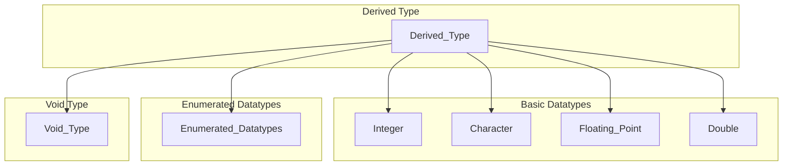
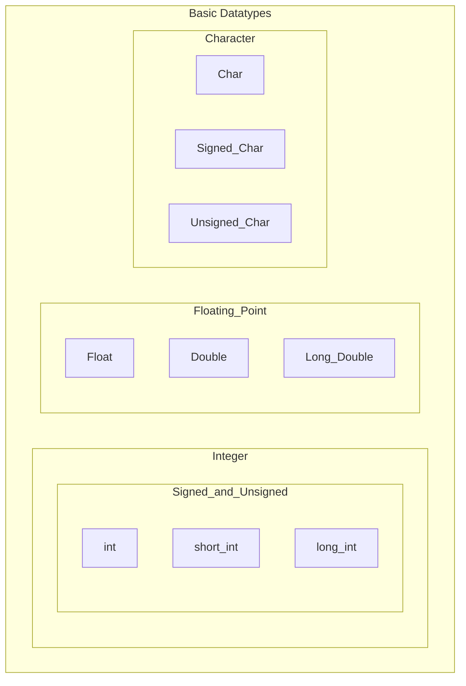
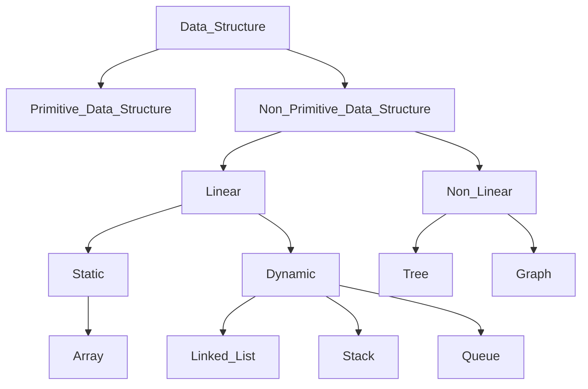

---
{"dg-publish":true,"permalink":"/college/sem-iv/ds/ds-tee-qb/intro-to-ds/itds-theory/"}
---

# Data Types
## Basic data types
### General Classification

### Basic Datatype Classification

### Table of Data Types: Their size and Value Range
| Data Type          | Size (Bytes) | Value Range               |
| ------------------ | ------------ | ------------------------- |
| char               | 1            | -128 to 127               |
| signed char        | 1            | -128 to 127               |
| unsigned char      | 1            | 0 to 255                  |
| int                | 2            | -32k to 32k               |
| signed int         | 2            | -32k to 32k               |
| unsigned int       | 2            | 0 to 64k                  |
| short int          | 2            | -32k to 32k               |
| signed short int   | 2            | -32k to 32k               |
| unsigned short int | 2            | 0 to 64k                  |
| long int           | 4            | -2147483648 to 2147483647 |
| signed long int    | 4            | -2147483648 to 2147483647 |
| unsigned long int  | 4            | 0 to 4294967295           |
| float              | 4            | 3.4E-38 to 3.4E+38        |
| double             | 8            | 1. 7E-308 to 1. 7E+308    |
| long double        | 10           | 3.4E-4932 to 1.1E+4932    | 

## Data structure definition
- Data structure is a data organisation, management, and storage format that enables efficient access and modification
- Data structure is a collection of data values, the relationships among them, and the functions or operations that can be applied to the data.


## Need for data structures
- A way of organizing, managing, and storing data efficiently
- The data items can be traversed easily.
- Provides efficiency, reusability and abstraction.
- Enhancing the performance of a program because the main function of the program is to store and retrieve the user’s data as fast as possible.

## Classification of Data Structures

## Operations on Data Structures
- Traverse
- Search
- Insert
- Delete
- Sort
- Merge
- Split
- Copy
## Abstract data type (ADT)
- An abstract data type is an abstraction of a data structure
- An ADT specifies:
	- Data stored
	- Operations on the data
	- Error conditions associated with operations

- Example: ADT modelling a simple stock trading system
- The data stored are buy/sell orders
- Operations supported are:
	- order buy(stock, shares, price)
	- order sell(stock, shares, price)
	- void cancel(order)
- Error Conditions:
	- Buy/sell a non-existent stock
	- Cancel a non-existent order

# Functions, Structures, and Pointers
## Function
### Function Declaration or Prototype
\[return_type] function_name( arg-type name-1,... , arg-type name-n);

### Function Definition
\[return_type] funtion_name( arg-type name-1,..., arg-type name-n)
	{
	 statements;
	}

### Function Call
- When a function is called, its stack frame is pushed onto the stack
- Then, the subroutine (function) instructions are executed
- Then, the stack frame of the function is popped from the stack
- Then the program goes back to the main stack using the address stored in the program counter
### Function Parameters
- You can either pass a parameter to a function or not
- If passing a parameter, there are two ways to do so:
	- Pass by value
	- Pass by reference
