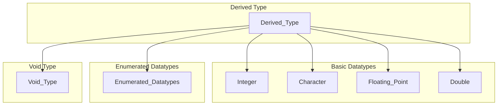
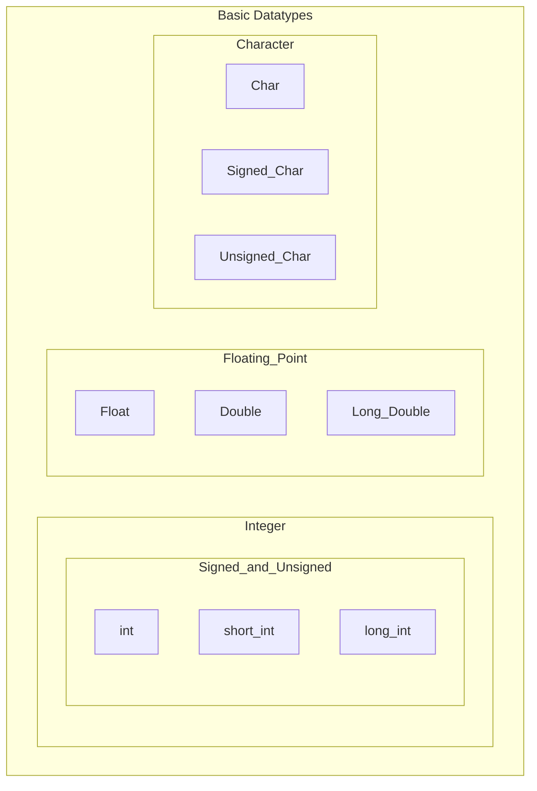
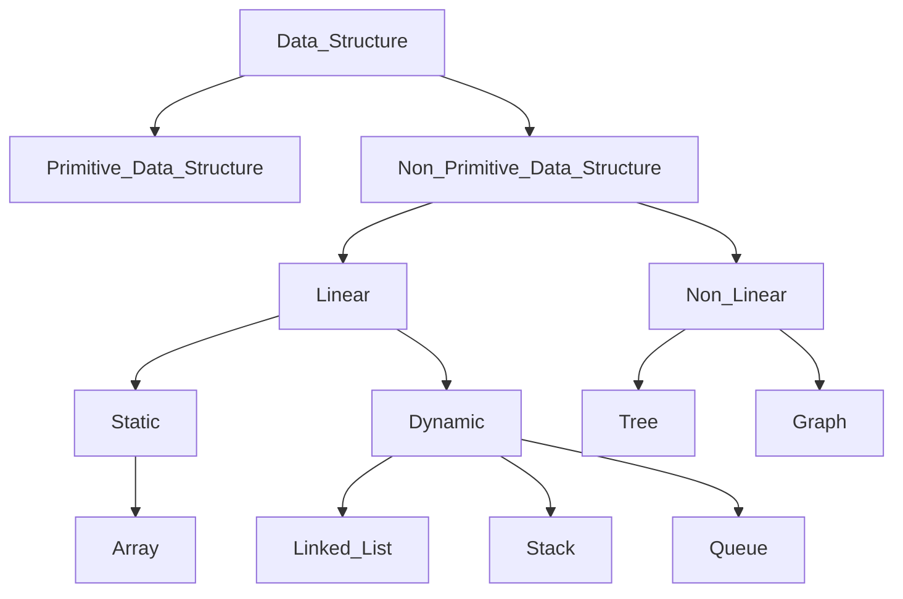

---
{"dg-publish":true,"permalink":"/college/sem-iv/ds/ds-tee-qb/intro-to-ds/itds-theory/"}
---


# Data Types
## Basic data types
### General Classification


### Basic Datatype Classification

### Table of Data Types: Their size and Value Range
| Data Type          | Size (Bytes) | Value Range               |
| ------------------ | ------------ | ------------------------- |
| char               | 1            | -128 to 127               |
| signed char        | 1            | -128 to 127               |
| unsigned char      | 1            | 0 to 255                  |
| int                | 2            | -32k to 32k               |
| signed int         | 2            | -32k to 32k               |
| unsigned int       | 2            | 0 to 64k                  |
| short int          | 2            | -32k to 32k               |
| signed short int   | 2            | -32k to 32k               |
| unsigned short int | 2            | 0 to 64k                  |
| long int           | 4            | -2147483648 to 2147483647 |
| signed long int    | 4            | -2147483648 to 2147483647 |
| unsigned long int  | 4            | 0 to 4294967295           |
| float              | 4            | 3.4E-38 to 3.4E+38        |
| double             | 8            | 1. 7E-308 to 1. 7E+308    |
| long double        | 10           | 3.4E-4932 to 1.1E+4932    | 

## Data structure definition
- Data structure is a data organisation, management, and storage format that enables efficient access and modification
- Data structure is a collection of data values, the relationships among them, and the functions or operations that can be applied to the data.


## Need for data structures
- A way of organizing, managing, and storing data efficiently
- The data items can be traversed easily.
- Provides efficiency, reusability and abstraction.
- Enhancing the performance of a program because the main function of the program is to store and retrieve the user’s data as fast as possible.

## Classification of Data Structures

## Operations on Data Structures
- Traverse
- Search
- Insert
- Delete
- Sort
- Merge
- Split
- Copy
## Abstract data type (ADT)
- An abstract data type is an abstraction of a data structure
- An ADT specifies:
	- Data stored
	- Operations on the data
	- Error conditions associated with operations

- Example: ADT modelling a simple stock trading system
- The data stored are buy/sell orders
- Operations supported are:
	- order buy(stock, shares, price)
	- order sell(stock, shares, price)
	- void cancel(order)
- Error Conditions:
	- Buy/sell a non-existent stock
	- Cancel a non-existent order

# Functions, Structures, and Pointers
## Functions
### Function Declaration or Prototype
\[return_type] function_name( arg-type name-1,... , arg-type name-n);

### Function Definition
\[return_type] funtion_name( arg-type name-1,..., arg-type name-n)
	{
	 statements;
	}

### Function Call
- When a function is called, its stack frame is pushed onto the stack
- Then, the subroutine (function) instructions are executed
- Then, the stack frame of the function is popped from the stack
- Then the program goes back to the main stack using the address stored in the program counter
### Function Parameters
- You can either pass a parameter to a function or not
- If passing a parameter, there are two ways to do so:
	- Pass by value
	- Pass by reference
### Recursion
- A function that calls itself is known as a recursive function.
- A recursive function has a base case, when met will effectively stop the recursive process.
## Structures
### Structure Definition & Declaration
```c++
struct coord
{
	int x;
	int y;
};
```

- Note: If defined like this, whenever a variable of type "coord" would need to be declared, it would need to be declared using "struct coord var_name". To remove repeating struct, see the code below.

```c++
typedef struct coord
{
	int x;
	int y;
} coord;
```

- Now, to declare a variable, you can just use "coord var_name".

- You can also :
```c++
struct coord
{
	int x;
	int y;
} first, second;
```

- This will declare two coord variables named "first" and "second", and they will be accessible to any function in the program such as "main" or any other user-defined function if not defined in any function.

### Accessing Structure Members
- Using the "." operator, we can access members of a struct.
- Take the earlier struct for example, this is how we can access its members:
```c++
struct coord first;
first.x = 100;
first.y = 50;
```

### Copying a struct
```c++
first = second;
```
- Is equivalent to:
```c++
first.x = second.x;
first.y = second.y;
```

### Structs containing structs
- Structs can be nested inside other structs (it can contain struct variables)
```c++
struct Person {
	Address address;
	int age;
	string name;
};
```
- They can also contain arrays

### Array of structs
- Arrays containing structs is possible:
```c++
typedef struct thing {
	int something;
} thing;

int main() {
	thing array[3];
}
```

## Pointers
### Introduction
- A pointer stores the address of another variable
- An integer pointer will store the address of an integer variable
```c++
int num = 69;
int *p = &num;
```
- Pointer "p" will store the memory address of the integer variable num

### Pointer Arithmetic
```c++
int num = 100;
int *pnum = &num;

char c = 'a';
char *pchar = &c;

pnum += 1; // Adds 1*sizeof(int) to memory address
pchar += 1; // Adds 1*sizeof(char) to memory address
```
- As you can see, incrementing a pointer depends on what it points
- If a pointer points to a char variable, it increments by the number * sizeof(char) bytes
- If it points to a int variable, then it increments by the number * sizeof(int) bytes

### Scale Factor
| Datatype | Scale Factor |
| -------- | ------------ |
| char     | 1            |
| int      | 4            |
| float    | 4            |
| double   | 8            |

- The scaling changes depending on what the pointer is pointing to

### Use in functions
- We will compare passing by value to passing by reference

- Let's take the swap function for example:
```c++
void swap(int a, int b) {
	int t = a;
	a = b;
	b = t;
}

int main() {
	int num1 = 5, num2 = 10;
	cout<<num1<<", "<<num2<<endl; // 5, 10
	swap(num1, num2);
	cout<<num1<<", "<<num2<<endl; // 5, 10
	return 0;
}
```
- Here, we are passing the values of "num1" and "num2"
- This means that "num1" and "num2" will still remain the same
- This is because when the variables are passed to a function, the function makes a copy of the values of "num1" and "num2" and stores them in the variables "a" and "b" respectively which only exist in the scope of that function
- The function swaps the values of the "a" and "b" variables, but when the function ends, those two variables are effectively erased
- When we return to the main function, the values of "num1" and "num2" are still the same

- Let's change the code to pass by reference instead:
```c++
void swap(int *a, int *b) {
	int t = *a;
	*a = *b;
	*b = t;
}

int main() {
	int num1 = 5, num2 = 10;
	cout<<num1<<", "<<num2<<endl; // 5, 10
	swap(&num1, &num2);
	cout<<num1<<", "<<num2<<endl; // 10, 5
	return 0;
}
```
- Here we are passing the memory address of the variables to the function
- This function will create a copy of the address value for the variables "num1" and "num2" and store them in the integer pointers "a" and "b" respectively which still only exist in the scope of the function
- The function will then perform the swap operation on the memory addresses stored within "a" and "b" which are the variables "num1" and "num2", and when the function ends, the two variables are erased
- When we return to the main function, the values of "num1" and "num2" are changed because the swap operations were performed on the them through pointers

### Use in Arrays
```c++
	int main() {
	int arr[] = {5, 6, 7, 8, 9};
	int *p = &arr[0]; // Address of the first element in array "arr"
	for (int i = 0; i < 5; i++, p++) { // p++ increments pointer to the next location in the array
		cout<<"Address: "<< p <<endl;
		cout<<"Value: "<< *p <<endl;
	}
	return 0;
}
```
- The pointer "p" is being used to keep track of the address and the value of the current element

