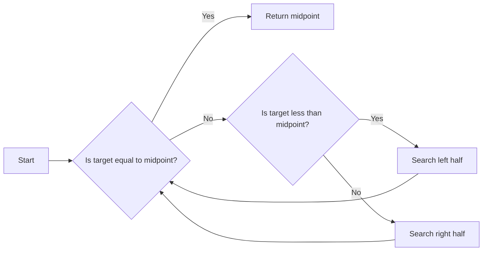

---
{"dg-publish":true,"permalink":"/college/sem-iv/ds/ds-tee-qb/searching-and-sorting/sas-theory/"}
---

# Linear Search
- Linear Search is normally used on an unordered list
- It's divided into two types
	- One Occurence (get the index of the first occurence of a particular number)
	- All occurence (gets index of all occurences of a particular number)

# Binary Search
- Binary Search is done on sorted data (Ascending or Descending)
- Binary Search keeps on dividing the array into smaller sub arrays until it either finds the value or checks all elements in the original array
- It can be summarized by the following sentence
> Given an integer `X` and integers $A_0, \space A_1, \space \text{.... ,} \space A_{N-1}$, which are presorted, find `i` suchthat $A_i  = X$, or return `i = -1` if `X` is not in the input data

## Flowchart showing standard steps for binary search

---

# Sorting

## What is Sorting?
Sorting is the process of arranging a collection of items in a particular order, typically in ascending or descending order based on some criteria. Sorting is an important algorithmic problem that arises in many applications, including databases, search engines, and computer graphics.

## Classification of Sorting Algorithms
- Computational Complexity
- Computational Complexity of Swaps
- Memory usage
- Recursion
- Stability

## Some types of Sorting Algorithms
- Bubble Sort
- Selection Sort
- Insertion Sort
- Shell Sort 
- Heap Sort
- Quick Sort
- Bucket Sort
- Merge Sort
- Radix Sort

---

# Bubble Sort
- It's a simple sorting algorithm
- aka exchange sort

## Bubble Sort Example
### First Iteration

### Second Iteration

### Third Iteration

### Fourth Iteration

## Pros and Cons of Bubble Sort
### Pros
- Simplicity and ease of implementation
### Cons
- Horribly Inefficient

---

# Divide and Conquer

- Divide and Conquer is a method of algorithm design.
- This method has three distinct steps:
	1. **Divide**: If the input size is too large to deal with in a straightforward manner,divide the data into two or more disjoint subsets.
	2. **Recur**: Use divide and conquer to solve the sub-problems associated with the data subsets.
	3. **Conquer**: Take the solutions to the sub-problems and "merge" these solutions into a solution for the original problem.

---
# Quick Sort

## Idea of a Quick Sort
1. **Select**: Pick an element (Let x be the element picked)
2. **Divide**: rearrange elements so that `x` goes to its final position E
3. **Recurse and Conquer**: recursively sort

## Quick Sort Tree

---

# Classification of Sorting Algorithms
- Comparision Sorts
	- Bubble Sort
	- Insertion Sort
	- Selection Sort
	- Shell Sort
	- Merge Sort
	- Quick Sort
	- Heap Sort
- Non Comparision sorts (Linear Time)
	- Count Sort
	- Radix Sort
	- Bucket Sort

# Sorting Complexity

- Selection Sort, Bubble Sort, Insertion Sort $O(n^2)$
- Heap Sort, Merge Sort $O(nlog_n)$
- Quick Sort $O(nlog_n)$ (average complexity)

# Bucket Sort

Bucket sort is a sorting algorithm that works by distributing elements of an array into a number of buckets. Each bucket is then sorted individually using another sorting algorithm or recursively applying the bucket sort algorithm. Finally, the sorted buckets are concatenated to produce the final sorted array.

## Example of Bucket Sort
1. The array to be sorted is - [`0.78, 0.11, 0.39, 0.26, 0.72, 0.94, 0.21, 0.12, 0.23, 0.68`]
2. Initialize the empty buckets
	- Bucket 0: []
	- Bucket 1: []
	- Bucket 2: []
	- Bucket 3: []
	- Bucket 4: []
	- Bucket 5: []
	- Bucket 6: []
	- Bucket 7: []
	- Bucket 8: []
	- Bucket 9: []
3. sort the elements into their respective buckets
	- Bucket 0: []
	- Bucket 1: [`0.17, 0.12, NULL`]
	- Bucket 2: [`0.26, 0.21, 0.23, NULL`]
	- Bucket 3: [`0.39, NULL`]
	- Bucket 4: []
	- Bucket 5: []
	- Bucket 6: [`0.68, NULL`]
	- Bucket 7: [`0.78, 0.72, NULL`]
	- Bucket 8: []
	- Bucket 9: [`0.94, NULL`]
4. Sort the individual buckets themselves
	- Bucket 0: []
	- Bucket 1: [`0.12, 0.17, NULL`]
	- Bucket 2: [`0.21, 0.23, 0.26, NULL`]
	- Bucket 3: [`0.39, NULL`]
	- Bucket 4: []
	- Bucket 5: []
	- Bucket 6: [`0.68, NULL`]
	- Bucket 7: [`0.72, 0.78, NULL`]
	- Bucket 8: []
	- Bucket 9: [`0.94, NULL`]
5. Join the buckets in order to get the final sorted sequence: [`0.12, 0.17, 0.21, 0.23, 0.26, 0.39, 0.68, 0.72, 0.78, 0.94`]

# Radix Sort

- Radix is the base of a number system.
- Radix sort is a multiple pass distribution sort.
- Radix sort uses bucket sort as the stable sorting algorithm, where the initial relative order of equal keys is unchanged

## Radix Sort Example

### Pass 1

### Pass 2

### Pass 3

### Result

## Classification of Radix Sort

Radix sort is classified based on how it works internally:
- least significant digit (LSD) radix sort
- most significant digit (MSD) radix sort

